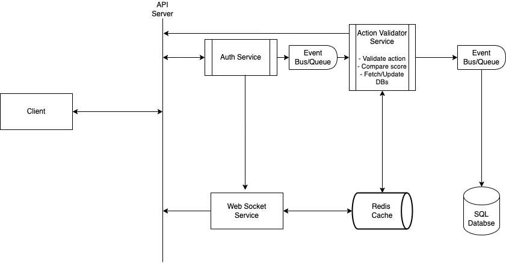

# Score API Service Specification

Based on the software requirements, the main actions are "event-based"

The features the service will have are:

- Users can sign up / log in
- Perform action to update score
- Get their up-to-update score
- Get list of top 10 score

Database schema will be simple;

```sql
CREATE TABLE users (
  -- Using integer for primary key because it's easier and faster to index, and sort.
  id INT SERIAL PRIMARY KEY,
  username VARCHAR(255) UNIQUE NOT NULL,
  score INTEGER DEFAULT 0,
  created_at DATE NOT NULL,
  updated_at DATE NOT NULL,
)
```

The endpoint will support 4 main endpoints;

- Sign ups
- Login
- Update user score (by performing action), returns new score.
- Web sockets: To broadcast score changes to all connected clients in real time. Retrieve live top 10 score updates

Scaling & Efficiency

- Use a form of caching strategy (eg. LRU) for the top 10 users. So once a new score from a user comes in, we compare if it's greater than the least of the top 10 score and we update accordingly.
- This cached data (LRU, or Redis, for top 10 users) will be distributed via a CDN for high availability.

Accuracy

- Use an event queue to track chronological order of events.
- Only increment score after action has been successfully completed.

Security

- Use jsonwebtoken (or maybe signed session tokens) for auth; as it's stateless.
- Data validation on submitted requests. Putting in mind how often we expect this action to be completed by one user.
- Rate limiting

---

Every payload will contain the user's last score - and we use jwt to make sure the data from the user isn't tampered. As opposed to fetching from the db for the user's last score (reduce the number of query)

---

Assuming the time the validator services uses to validate a work is O(1)
New request -> Load Balancer? -> Auth -> Validator Service -> Event Queue (or Bus) -> [DB, Cache]

Diagram (view with white background):



